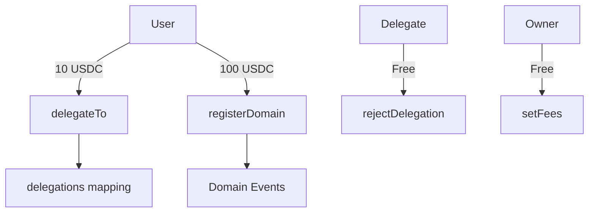
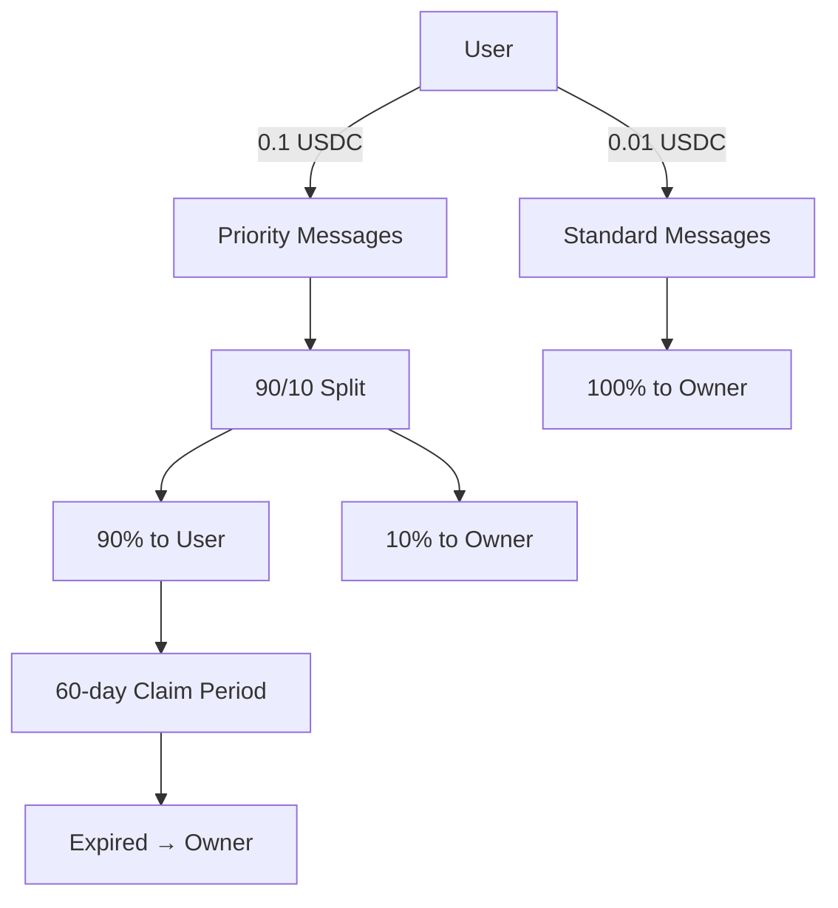

# MailBox Contracts Architecture

This document provides a comprehensive overview of the MailBox smart contract system architecture, including design patterns, data flows, and economic models.

## System Overview

The MailBox system consists of two main contracts that work together to provide a decentralized messaging platform with economic incentives:

1. **MailService** - Domain registration and delegation management
2. **Mailer** - Message sending with revenue sharing

## Contract Architecture

### MailService Contract



**Core Responsibilities**:
- Domain name registration and lifecycle management
- Delegation relationship management
- Fee collection and management
- Access control for administrative functions

**Storage Design**:
```solidity
mapping(address => address) public delegations;  // delegator => delegate
uint256 public registrationFee;                  // 100 USDC default
uint256 public delegationFee;                    // 10 USDC default
```

**Event-Driven Architecture**:
- All domain operations emit events for off-chain indexing
- Unified `DelegationSet` event for both setting and clearing
- Fee update events for transparency

### Mailer Contract



**Core Responsibilities**:
- Message sending with fee collection
- Revenue sharing calculations
- Claim period management
- Fee tier differentiation

**Storage Design**:
```solidity
struct ClaimableAmount {
    uint256 amount;     // USDC amount claimable
    uint256 timestamp;  // When claimable amount was set
}
mapping(address => ClaimableAmount) public recipientClaims;
uint256 public ownerClaimable;
```

## Economic Model

### Fee Structure

| Operation | Fee | Revenue Share | Claim Period |
|-----------|-----|---------------|--------------|
| Domain Registration | 100 USDC | 0% | N/A |
| Delegation | 10 USDC | 0% | N/A |
| Priority Message | 0.1 USDC | 90% to sender | 60 days |
| Standard Message | 0.01 USDC | 0% | N/A |

### Revenue Sharing Flow

1. **Priority Message Sent**:
   - User pays 0.1 USDC
   - 90% (0.09 USDC) → Claimable by sender
   - 10% (0.01 USDC) → Owner claimable
   - Message sent to sender (self-messaging)

2. **Claim Period**:
   - 60 days to claim revenue share
   - Timestamp updated on each new message
   - Claims accumulate for multiple messages

3. **Expiration Handling**:
   - After 60 days, shares become unclaimable
   - Owner can reclaim expired shares
   - Prevents indefinite liability

## Design Patterns

### Factory Pattern
- TypeChain-generated factories for contract deployment
- Standardized deployment and connection patterns
- Type-safe contract instantiation

### Event Sourcing
- All state changes emit events
- Off-chain indexing for complex queries
- Immutable audit trail

### Revenue Sharing Pattern
- Delayed claim mechanism with expiration
- Accumulating claims for efficiency
- Time-based access control

### Delegation Pattern
- Bidirectional control (set/reject)
- Clear permission model
- Fee-based spam prevention

## Security Architecture

### Access Control
```solidity
modifier onlyOwner() {
    if (msg.sender != owner) revert OnlyOwner();
    _;
}
```

### Economic Security
- Fee-based spam prevention
- USDC transfer validation
- Time-locked claims with expiration

### Input Validation
- Non-empty domain validation
- Address validation for delegations
- Overflow protection with Solidity 0.8+

## Data Flow Diagrams

### Domain Registration Flow
```
User → [Approve USDC] → MailService
MailService → [Transfer USDC] → Contract
MailService → [Emit Event] → Off-chain Indexer
```

### Message Sending Flow (Priority)
```
User → [Approve USDC] → Mailer
Mailer → [Transfer USDC] → Contract
Mailer → [Split Revenue] → Storage
Mailer → [Emit MailSent] → Event Log
User → [Claim Revenue] → USDC Transfer
```

### Delegation Flow
```
Delegator → [Pay Fee] → MailService
MailService → [Set Mapping] → Storage
MailService → [Emit Event] → Event Log
Delegate → [Reject] → Clear Mapping
```

## Gas Optimization Strategies

### Storage Optimization
- Packed structs for efficient storage
- Immutable variables for constants
- Minimal state variable updates

### Function Optimization
- External over public for interfaces
- Calldata for read-only parameters
- Batch operations where possible

### Event Optimization
- Indexed parameters for filtering
- Minimal event data
- Off-chain computation preferences

## Integration Patterns

### Frontend Integration
```typescript
// Type-safe contract interactions
const mailService = MailService__factory.connect(address, signer);
const result = await mailService.delegateTo(delegateAddress);

// Event listening
mailService.on("DelegationSet", (delegator, delegate, event) => {
    // Handle delegation change
});
```

### Testing Patterns
```typescript
// Standard test setup
await mockUSDC.mint(user.address, ethers.parseUnits("100", 6));
await mockUSDC.connect(user).approve(contractAddress, amount);

// Event testing
await expect(contract.function(...args))
  .to.emit(contract, "EventName")
  .withArgs(...expectedArgs);
```

## Upgrade Considerations

### Current Limitations
- Immutable contracts (no upgrade mechanism)
- Fixed fee percentages
- Static claim periods

### Future Upgrade Paths
- Proxy pattern implementation
- Governance-controlled parameters
- Modular contract architecture

## Network Considerations

### Gas Costs (Estimated)
- Domain Registration: ~80k gas
- Delegation: ~60k gas
- Priority Message: ~90k gas
- Standard Message: ~70k gas
- Claim Revenue: ~45k gas

### Multi-chain Deployment
- Hardhat configuration supports multiple networks
- USDC availability consideration
- Gas cost variations across chains

## Monitoring and Analytics

### Key Metrics
- Total domains registered
- Active delegations
- Message volume by tier
- Revenue sharing utilization
- Claim vs expiration rates

### Event Indexing
```javascript
// Example event indexing structure
{
  "DomainRegistered": {
    "domain": "example.com",
    "registrar": "0x...",
    "expiration": 1234567890
  },
  "MailSent": {
    "from": "0x...",
    "to": "0x...",
    "timestamp": 1234567890
  }
}
```

## Deployment Architecture

### Local Development
```
Hardhat Network (chainId 1337)
├── MailService Contract
├── Mailer Contract
├── MockUSDC Contract
└── TypeScript Clients
```

### Production Deployment
```
Target Network
├── MailService (Proxy Pattern)
├── Mailer (Proxy Pattern)
├── Real USDC Integration
└── Multi-sig Owner
```

This architecture ensures scalability, security, and maintainability while providing clear economic incentives for decentralized messaging adoption.